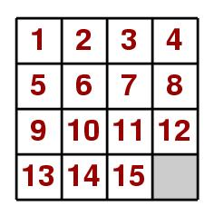

# AI-Project
NYU AI course

A* Search Strategy for solving the 15-puzzle problem.
Use sum of Manhattan distances of tiles from their goal positions as heuristic function h(n).

On a 4 x 4 board there are 15 tiles numbered from 1 to 15 and a blank position. 
A tile can slide into the blank position if it is horizontally or vertically adjacent to the blank position. 
Given a start board configuration and a goal board configuration, find a sequence of moves to reach the goal configuration from the start configuration. 
The goal is to find a solution with minimum number of moves.

Commonly used heuristics for this problem are:

* H1: counting the number of misplaced tiles, and

* H2: finding the sum of the Manhattan distances between each block
      and its position in the goal configuration
